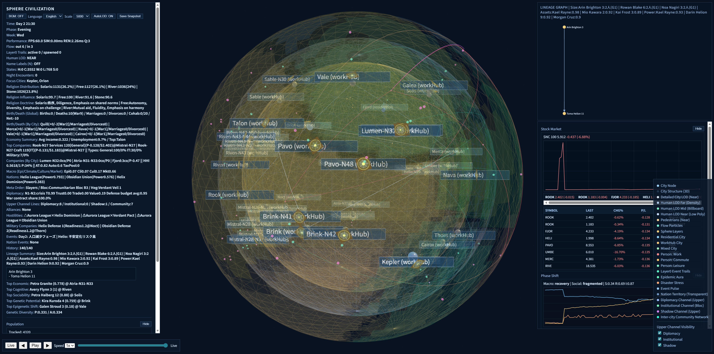
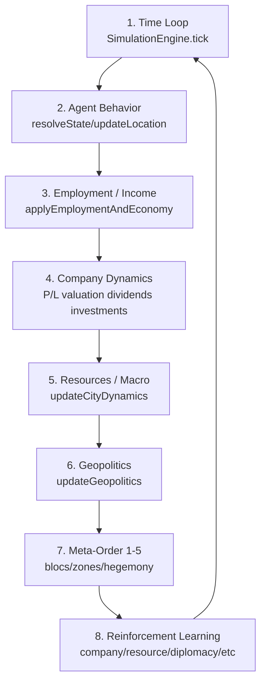

# Sphere Civilization Simulation (Phase 2 Foundation)

This repository now contains an initial implementation scaffold for the project vision in `Project Overview.md`.



## Implemented

- Deterministic simulation clock with daily phases.
- Multi-layer spherical world data model (layers, cities, edges).
- City socioeconomic metrics for flow utility estimation.
- Commuting flow model influenced by day phase, city type, economics, congestion, and safety.
- Flow-to-particle translation layer (rendering-ready payloads).
- Individual `Person` model with identity, traits, ability, and socioeconomic attributes.
- Daily behavior state machine: `Home | Commute | Work | Leisure | Sleep`.
- Night-time social encounter estimator by city.
- Hybrid population view:
  - tracked individuals for behavior simulation
  - sampled active individuals in focus cities for near-detail rendering
- Runnable entry point that simulates one full day and prints flow + person state summaries.

## Run

```bash
npm start
```

## Web Viewer (Three.js)

```bash
npm run start:web
```

Then open:

```text
http://127.0.0.1:5173/
```

Notes:
- The web viewer uses local `node_modules/three` (no CDN dependency).
- The simulation core is shared with the CLI run; the browser renders sphere layers, city nodes, and moving flow particles with a HUD.
- Simulation can run in a Web Worker (`web/simWorker.js`) to decouple render and simulation loops.

## MCP Server

```bash
npm run start:mcp
```

This starts a stdio MCP server (`scripts/mcpServer.js`) that exposes tools to inspect and advance the simulation world:

- `sphere_world_summary`
- `sphere_tick`
- `sphere_get_city`
- `sphere_list_companies`
- `sphere_list_secret_societies`
- `sphere_rank_public_services`
- `sphere_hud_snapshot`
- `sphere_reset`

## MCP Perspective (For Repository Readers)

In this project, MCP is the **control plane** for the simulation.

- Simulation core (`src/sim/engine.js`, `src/world/model.js`) evolves world state.
- MCP server (`scripts/mcpServer.js`) exposes that state and control actions as tools.
- Web viewer is the **visualization plane**; MCP is the **programmatic experiment plane**.

Typical MCP workflow:

1. Observe current state (`sphere_world_summary`, `sphere_hud_snapshot`).
2. Intervene (`sphere_tick`, policy/scale changes, or `sphere_reset` with seed).
3. Re-observe and compare (`sphere_geopolitics_report`, `sphere_stratification_report`, `sphere_company_financials`, etc.).
4. Export evidence (`sphere_export_snapshot`) for reproducible analysis.

Why this matters:

- Deterministic experiments via seed/snapshot.
- Same world can be analyzed from macro (HUD/reports) to micro (city/person/company).
- AI agents can run repeatable hypothesis loops without depending on UI interaction.

## Architecture 1-8 (System Map)

This project can be read in the following 8 fixed layers:

1. **Time Loop**
   - Main tick orchestration in `src/sim/engine.js` (`SimulationEngine.tick`).
   - Advances phase/time, runs all subsystem updates, and emits a frame.
2. **Agent Behavior**
   - Person state transitions and movement in `src/sim/population.js` (`resolveState`, `updateLocation`).
   - Models `Home | Commute | Work | Leisure | Sleep`.
3. **Employment / Income**
   - Hiring, employer matching, and income dynamics in `applyEmploymentAndEconomy`.
   - Includes regime/strain/policy coupling for employment probability.
4. **Company Dynamics**
   - Company lifecycle, P/L, valuation, dividends, ownership, and investments.
   - Includes `General/IT/Military` type logic and concentration guardrails.
5. **Resources / Macro**
   - Resource cycles, macro shocks, and city metric propagation in `src/sim/cityDynamics.js`.
   - Updates productivity, cost of living, instability, and city type drift.
6. **Geopolitics**
   - Diplomacy tension/status (`peace/crisis/war/alliance`) in `src/sim/geopolitics.js`.
   - Includes border restrictions, territorial shifts, and nation policy levers.
7. **Meta-Order (1-5 layers)**
   - Governance stack from world-system to hegemonic networks in geopolitics state.
   - Reported through frame geopolitics outputs and MCP tools.
8. **Reinforcement Learning**
   - RL policies for company/resource/diplomacy/secret-society/investment decisions.
   - Uses epsilon-greedy action selection with Q-value updates.



### MCP Client Config

Use [mcp.config.example.json](/home/hacker/Project/sphere/mcp.config.example.json) as a template in your MCP client.

Core settings:

- `command`: `npm`
- `args`: `["run", "start:mcp"]`
- `cwd`: `/home/hacker/Project/sphere`

### Codex

Project-local Codex config is included at [`.codex/config.toml`](/home/hacker/Project/sphere/.codex/config.toml).
From this project directory, run:

```bash
codex mcp list
```

You should see `sphere-world` in the list.

## Quick Start (Recommended)

```bash
npm install
npm run dev:all
```

Default endpoints:

- Web: `http://127.0.0.1:5174`
- State API: `http://127.0.0.1:5180`

## Safe Defaults

This project is **local-only by default**.

- `start:web` refuses non-loopback hosts unless explicitly overridden.
- `start:mcp` (State API) refuses non-loopback hosts unless explicitly overridden.

To intentionally expose beyond localhost (unsafe), set:

```bash
SPHERE_ALLOW_UNSAFE_EXPOSE=1
```

And then pass explicit hosts/ports as needed.

Tool calls are audit-logged to:

- `web/tool_audit.log`

## Scenario Regression

```bash
npm run test:scenarios
```

This runs deterministic policy scenarios against city dynamics to catch behavioral regressions.

## Current Scope

This is a **Phase 2 foundation**, not full WebGL rendering yet. It establishes core simulation outputs (`flows`, `particles`, `people`) so a WebGL/Three.js front-end can be attached without changing core logic.

## Recommended Next Build Step

- Add a browser renderer (Three.js) that draws:
  - sphere layers
  - city nodes
  - animated edge flow particles
- Move simulation loop to a Web Worker for stable frame rates.
