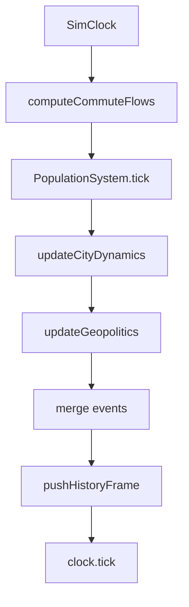
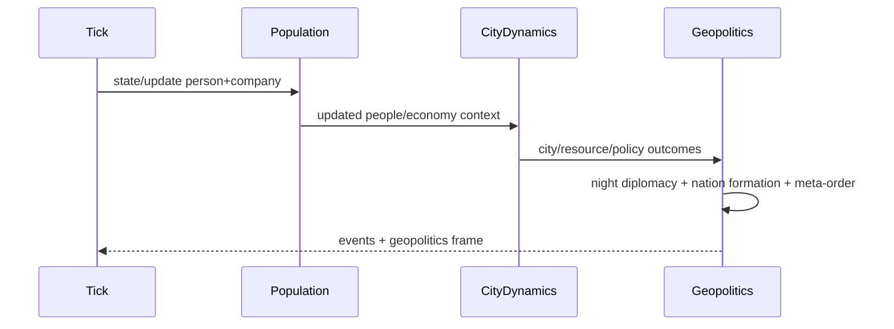

# Sphere System 1-8 Report

## 1. Time Loop
- 1 tick（既定30分）で世界が更新されます。
- 順序は `Flow -> Population -> CityDynamics -> Geopolitics -> Frame保存`。
- 実装: [engine.js](/home/hacker/Project/sphere/src/sim/engine.js:21), [defaultConfig.js](/home/hacker/Project/sphere/src/config/defaultConfig.js:3)
- 単純化:
- サブシステムは同tick内で逐次反映（同時方程式解法ではない）
- 履歴は有限長（既定240）



## 2. Agent Behavior
- 個人はフェーズごとに状態遷移（Home/Commute/Work/Leisure/Sleep）。
- 状態は性格・宗教補正・週末補正の確率で決まります。
- 移動は `hasTransitPath` で到達可能性を確認して更新。
- 実装: [population.js](/home/hacker/Project/sphere/src/sim/population.js:1271), [population.js](/home/hacker/Project/sphere/src/sim/population.js:1304), [model.js](/home/hacker/Project/sphere/src/world/model.js:49)
- 単純化:
- 行動はルールベース確率遷移で、明示的計画生成は未実装

## 3. Employment / Income
- 就業候補は `currentState === Work` の人。
- 都市ごとに採用枠 `capacity` を算出し、候補を能力順でソート。
- 採用確率:
- 枠内 `0.92 - shock + rehireBoost`
- 枠外 `max(0.01, 0.08 + rehireBoost - shock)`
- 雇用後に `pickEmployer` で企業割当。
- 所得は賃金水準・通貨購買力・雇用ペナルティ等で計算。
- 実装: [population.js](/home/hacker/Project/sphere/src/sim/population.js:1404), [population.js](/home/hacker/Project/sphere/src/sim/population.js:1472), [population.js](/home/hacker/Project/sphere/src/sim/population.js:4162), [population.js](/home/hacker/Project/sphere/src/sim/population.js:1515)
- 単純化:
- 応募/面接/求人探索の明示プロセスはなく、都市内選抜型

## 4. Company Dynamics
- 企業は売上/費用/利益/株価をtickごとに更新。
- 供給網ブースト、競争ペナルティ、ショック（疫病/気候）を反映。
- ライフサイクルとして創業・買収(M&A)・整理が発生。
- 実装: [population.js](/home/hacker/Project/sphere/src/sim/population.js:1490), [population.js](/home/hacker/Project/sphere/src/sim/population.js:3560), [population.js](/home/hacker/Project/sphere/src/sim/population.js:4192)
- 単純化:
- 会計は簡略化された疑似P/L中心（精密B/Sではない）

## 5. Resources / Macro
- 都市資源（water/food/energy/metals/human）から生産効率・コストを計算。
- 世界システム側で市場指数・疫病・気候・文化ドリフトが全体に影響。
- 実装: [cityDynamics.js](/home/hacker/Project/sphere/src/sim/cityDynamics.js:8), [population.js](/home/hacker/Project/sphere/src/sim/population.js:1596), [defaultConfig.js](/home/hacker/Project/sphere/src/config/defaultConfig.js:26)
- 単純化:
- 資源市場は連続体近似で、需給均衡の厳密解は取っていない

## 6. Geopolitics
- 夜フェーズに外交テンションを更新し、`peace/alliance/crisis/war` を遷移。
- 条件で戦争・停戦・制裁イベント、領土移管が発生。
- 建国ロジックで都市圧力から新国家が分離生成。
- 実装: [geopolitics.js](/home/hacker/Project/sphere/src/sim/geopolitics.js:13), [geopolitics.js](/home/hacker/Project/sphere/src/sim/geopolitics.js:31), [geopolitics.js](/home/hacker/Project/sphere/src/sim/geopolitics.js:798), [geopolitics.js](/home/hacker/Project/sphere/src/sim/geopolitics.js:982)
- 単純化:
- 国家意思決定は代表指標ベースで、国内政治モデルは軽量

## 7. Meta-Order (1-5 layers)
- 追加済みの5層を夜間に順次更新:
1. world_system
2. civilization_blocs
3. institutional_zones
4. nation_city_governance
5. hegemonic_networks
- `blocs`, `institutionalZones`, `hegemonicNetworks` が `geopolitics` に出力。
- 実装: [geopolitics.js](/home/hacker/Project/sphere/src/sim/geopolitics.js:264), [geopolitics.js](/home/hacker/Project/sphere/src/sim/geopolitics.js:180), [mcpServer.js](/home/hacker/Project/sphere/scripts/mcpServer.js:2135)
- 単純化:
- 層間作用はスコア合成中心（厳密な制度ゲーム理論モデルではない）

## 8. Reinforcement Learning
- 中核は epsilon-greedy + 単純Q更新:
- 行動選択: 探索 `rand < epsilon`、それ以外は `argmax Q`
- 更新: `Q <- Q + alpha * (reward - Q)`
- 適用ドメイン:
- 企業戦略RL
- 資源政策RL
- 外交RL
- 秘密結社RL
- 投資機関RL
- 移住バンディット
- 制度運用RL
- 実装: [population.js](/home/hacker/Project/sphere/src/sim/population.js:1812), [cityDynamics.js](/home/hacker/Project/sphere/src/sim/cityDynamics.js:247), [geopolitics.js](/home/hacker/Project/sphere/src/sim/geopolitics.js:778), [defaultConfig.js](/home/hacker/Project/sphere/src/config/defaultConfig.js:121), [mcpServer.js](/home/hacker/Project/sphere/scripts/mcpServer.js:245)
- 単純化:
- 多くは割引将来報酬付きMDPではなく、即時報酬寄りのバンディット運用



```mermaid
graph LR
  S[Context] --> A[epsilon-greedy Action]
  A --> R[Reward]
  R --> U[Q update: Q=Q+alpha*(r-Q)]
  U --> P[Policy table qByAction/nByAction]
  P --> A
```

## Update Notes (2026-03-01)

This section records structural changes applied after the initial 1-8 report.

### A. Employment model changed to company-led hiring

- Previous model: city-level capacity first, then worker allocation.
- Current model: company-level openings are posted first (`openPositionsPosted`), then workers can only match to companies with remaining `openPositions`.
- Key code:
  - [population.js](/home/hacker/Project/sphere/src/sim/population.js:1459)
  - [population.js](/home/hacker/Project/sphere/src/sim/population.js:1493)
  - [population.js](/home/hacker/Project/sphere/src/sim/population.js:4213)

### B. Policy Genome introduced in city dynamics

- Added `policyGenome` config and runtime state.
- Each city now has a genome vector:
  - `safetyFocus`, `welfareFocus`, `educationFocus`
  - `greenAffinity`, `growthAffinity`
  - `explorationBias`, `mutationRate`
  - `fitnessEma`
- Genome affects:
  1. effective policy budgets (safety/welfare/education)
  2. RL exploration and action preference in resource policy
  3. periodic evolution by inheritance + mutation
- Evolution loop runs every `policyGenome.evolutionIntervalTicks` (default 48).
- Key code:
  - [defaultConfig.js](/home/hacker/Project/sphere/src/config/defaultConfig.js:72)
  - [cityDynamics.js](/home/hacker/Project/sphere/src/sim/cityDynamics.js:235)
  - [cityDynamics.js](/home/hacker/Project/sphere/src/sim/cityDynamics.js:286)
  - [cityDynamics.js](/home/hacker/Project/sphere/src/sim/cityDynamics.js:338)

### C. Impact on 1-8 interpretation

- Section 3 (Employment/Income): now explicitly company-openings constrained.
- Section 5 (Resources/Macro): resource policy RL is now genome-biased.
- Section 8 (RL): remains epsilon-greedy + Q-update, but genome adds a slower-timescale policy prior (complementary, not replacing RL).
